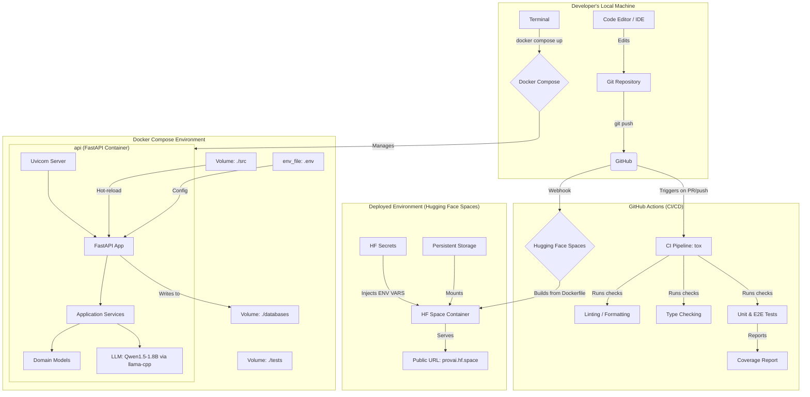

# ProVAI Infrastructure Overview

This document provides a detailed overview of the ProVAI system's infrastructure, developer workflow, and deployment pipeline. It serves as the master blueprint for how the application is built, tested, and delivered.

---

## 1. System Architecture Diagram

This diagram visualizes the complete end-to-end lifecycle of the ProVAI project, from local development to automated quality assurance and final deployment.

---

## 2. Local Development Environment

This environment is designed for developer productivity and consistency. It is entirely orchestrated by **Docker Compose**.

- **Orchestrator:** The `docker-compose.yml` file defines and manages the `api` service.
- **API Container:** A single Docker container running our FastAPI application. It loads all AI models and application services directly into its memory. The container is run using `uvicorn --reload` to enable hot-reloading.
- **Data Persistence:** The `src/`, `databases/`, and `vector_store/` directories are mounted as volumes from the host machine. This ensures that code changes are reflected instantly and that all data generated by SQLite and ChromaDB is persisted between container restarts.
- **Workflow:** A developer runs `docker compose up` to start the environment. Any code saved locally is instantly updated in the container, providing a seamless development loop.

---

## 3. CI/CD Pipeline (GitHub Actions)

This automated pipeline ensures code quality and consistency before any changes are merged into the `main` branch.

- **Trigger:** The workflow is triggered on every `push` or `pull_request` to the `main` branch.
- **Orchestrator:** We use **`tox`** as the single source of truth for running all checks. This ensures the CI environment behaves identically to the local testing environment.
- **Quality Gates:** The pipeline performs several checks in sequence:
  1.  **Linting & Formatting:** `ruff` checks for code style and formatting consistency.
  2.  **Type Checking:** `mypy` performs strict static type analysis.
  3.  **Testing:** `pytest` runs the full suite of unit and end-to-end tests.
  4.  **Coverage Analysis:** `pytest-cov` measures test coverage and will fail the build if it drops below our defined threshold (e.g., 80%). A report is posted as a comment on the pull request.
- **Branch Protection:** The `main` branch is protected, requiring all these checks to pass and at least one peer review before a PR can be merged.

---

## 4. Production Deployment Environment (Hugging Face Spaces)

This architecture describes how the ProVAI MVP is deployed for public access, leveraging the managed infrastructure of Hugging Face Spaces for a no-cost, scalable solution.

- **Host:** A **Hugging Face Space** configured to run Docker containers.
- **Container:** The same `Dockerfile` is used, but the `production` stage is targeted. This creates a lean, secure image that contains only production dependencies and runs the application with a robust **Gunicorn** server.
- **Persistent Storage:** The Space is configured with a persistent storage volume, which is mounted into the container. Our SQLite and ChromaDB files live here, ensuring data survives restarts and deployments.
- **Secrets Management:** All sensitive credentials (API keys, etc.) are stored as encrypted **HF Secrets**. These are securely injected into the container as environment variables at runtime and are never exposed in our code or build logs.
- **Continuous Deployment:** A webhook connects our GitHub repository to the Hugging Face Space. When a pull request is merged into `main`, Hugging Face automatically pulls the latest code, rebuilds the Docker image, and deploys the new version, creating a seamless and automated deployment process.
