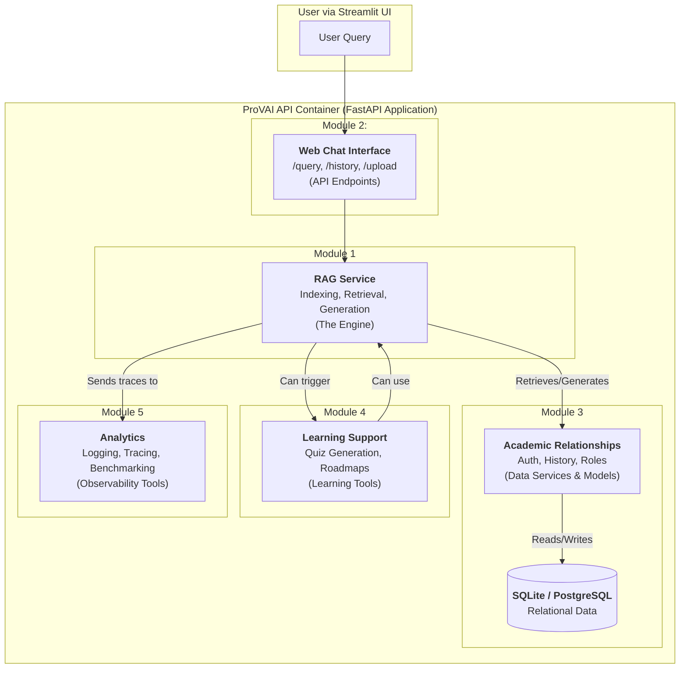

# ProVAI Core Modules Overview

This document defines the five core modules of the ProVAI project. It outlines the purpose of each module and details its phased implementation across our **"Crawl, Walk, Run"** development strategy, workinf as a strategic map for the project's evolution from a functional MVP to a feature-rich, intelligent AI tutor.

---

## Module Architecture Diagram

This diagram shows the "ProVAI API" container as the system boundary. Inside, the key modules are organized by their function, showing the primary flow of a user query through the system.

---

## 1. RAG System

**Purpose:** This is the intelligent heart of ProVAI. Its sole responsibility is to answer user queries by retrieving relevant information from course documents and generating coherent, context-aware responses.

### **MVP Implementation ("Crawl" Phase)**

The initial goal is to build a simple, robust, and functional RAG pipeline. This is the focus of **Milestone 2**.

- **Core Engine:** Implement the basic "Retrieve -> Generate" chain using LangChain Expression Language (LCEL).
- **Indexing:** Use `RecursiveCharacterTextSplitter` for chunking documents.
- **Retrieval:** Perform basic vector similarity search with a fixed `k` value.

### **Post-MVP Enhancements ("Walk" Phase)**

The focus shifts to improving the quality and precision of the retrieval process.

- **Contextual Retrieval:** Implement the `Parent Document Retriever` to provide richer context to the LLM.
- **Filtered Retrieval:** Implement `Query Structuring` to allow users to filter results based on document metadata.

### **Long-Term Vision ("Run" Phase)**

The engine will evolve into a fully agentic system capable of complex reasoning and self-correction.

- **Architectural Refactor:** Rebuild the core logic into a `LangGraph` state machine to enable cyclical, decision-driven workflows.
- **Corrective-RAG:** Implement a `Web Search` fallback tool that the agent can use when document retrieval yields no relevant results.
- **Advanced Query Transformation:** Explore and benchmark advanced techniques like `RAG-Fusion` to handle ambiguous user queries.

---

## 2. Web Chat Interface

**Purpose:** This module provides the primary user interface for students and teachers to interact with the ProVAI system. It handles user input, displays conversations, and manages chat sessions.

### **MVP Implementation ("Crawl" Phase)**

The focus is on delivering a functional and usable interface with minimal technical risk. This is the focus of **Milestone 3**.

- **Framework:** Build the entire UI **exclusively with Streamlit**.
- **Layout:** Implement a professional **two-panel layout**, featuring a main chat area and a sidebar for session navigation.
- **Core Functionality:** Build essential user authentication forms, a context-aware document uploader, and a dynamic chat history display.

### **Post-MVP Enhancements ("Walk" Phase)**

The UI will be enhanced with more sophisticated session management and collaborative features.

- **Full Session Management:** Implement the full lifecycle for creating, switching, and deleting chat sessions from the sidebar.

### **Long-Term Vision ("Run" Phase)**

The interface will evolve to include power-user features.

- **Power Features:** Implement advanced features like multi-message selection, session duplication, and full data portability.

---

## 3. Academic Relationships

**Purpose:** This module defines the data structures, relationships, and permissions that model our specific educational use case. It answers questions like "Who owns a chat?" and "Which students can access which documents?"

### **MVP Implementation ("Crawl" Phase)**

Establish the foundational data model to support a multi-user chat environment. This is a core part of **Milestone 1**.

- **Core Entities:** Define and create migrations for the `User` (with a `role` field), `Chat`, `Document`, and `SessionHistory` models.
- **Authentication:** Implement the core `AuthService` for secure user registration and login.

### **Post-MVP Enhancements ("Walk" Phase)**

Introduce formal roles and permissions to create a true multi-user collaborative environment.

- **Role-Based Access Control (RBAC):** Implement the `ChatMembership` table to formally link students to specific chats. Secure API endpoints based on "Teacher" or "Student" roles.

### **Long-Term Vision ("Run" Phase)**

The data model will be enriched to support deep personalization.

- **Automated Profiling:** Implement the `Profile` model and the automated background service that analyzes chat history to infer user characteristics.

---

## 4. Learning Support

**Purpose:** This module extends ProVAI from a reactive Q&A bot into a proactive learning companion. It is designed to be a student-centric, non-evaluative space for self-assessment and guided learning. Student autonomy is paramount.

### **MVP Implementation ("Crawl" Phase)**

_No features from this module will be included in the MVP._

### **Post-MVP Enhancements ("Walk" Phase)**

Deliver a suite of standalone, high-value learning tools.

- **Self-Assessment Quizzes:** Implement a service to generate simple, non-graded quizzes from documents, providing students with a private tool to check their understanding.
- **Date-Aware Roadmaps:** Implement a service to generate a topic-based study plan. Teachers will be able to manually annotate this roadmap with optional notes and external evaluation dates to help guide students.

### **Long-Term Vision ("Run" Phase)**

Orchestrate all learning tools into a single, intelligent, and automated workflow.

- **Automated Tutor:** Build the full, guided learning workflow (Roadmap -> Diagnostic -> Lesson -> Quiz) using the LangGraph state machine.

---

## 5. Analytics

**Purpose:** This module provides actionable insights into system health and user engagement. It is designed to empower both developers with performance data and teachers with privacy-preserving classroom insights. The guiding philosophy is to provide **actionable insights, not vanity metrics.**

### **MVP Implementation ("Crawl" Phase)**

Focus on foundational, developer-centric observability.

- **API Logging:** Implement a global middleware to log every API request and its performance.
- **AI Tracing:** Integrate LangSmith for deep, step-by-step traces of every RAG chain execution.
- **Performance Benchmarking:** Establish and document baseline performance metrics for the headless engine.

### **Post-MVP Enhancements ("Walk" Phase)**

Build the first generation of the "Classroom View" for teachers.

- **High-Level Dashboard:** Create a navigational hub for teachers to see an overview of their active chats.
- **Classroom Management Panel:** Within a specific chat, provide tools for teachers to manage the student roster and edit the learning roadmap.
- **Actionable Insights Panel:** Within a specific chat, display AI-generated, anonymized insights about which topics students are struggling with, and suggest concrete actions (e.g., "Generate a worksheet on Topic X").

### **Long-Term Vision ("Run" Phase)**

Evolve into a proactive "Insight Engine" that closes the feedback loop.

- **Intervention Tracking:** Implement a system to measure the effectiveness of a teacher's actions. After a teacher generates a worksheet for a difficult topic, the system will report back on whether student queries on that topic have decreased.
- **Automated Alerting:** Create automated alerts for both developers (e.g., "Error rate has spiked") and teachers (e.g., "A majority of your class seems to be stuck on Lesson 2").
