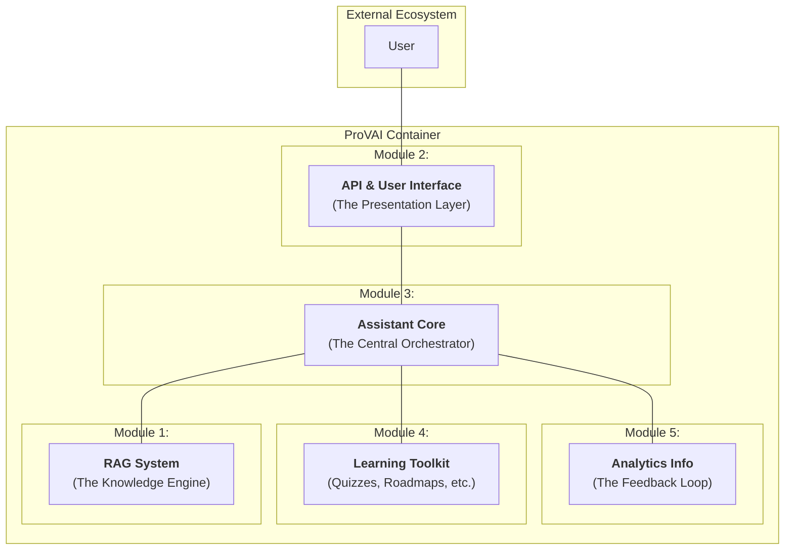

# ProVAI Core Modules Overview

This document defines the five core modules of the ProVAI project. It outlines the purpose of each module and details its phased implementation across our **"Crawl, Walk, Run"** development strategy.

---

## Module Architecture Diagram

This diagram illustrates the high-level architecture of the ProVAI system. The `API & User Interface` module is the entry point for users, while the `Assistant Core` is the central orchestrator, using the other modules as specialized features.

---

## 1. RAG System

**Purpose:** A specialized engine used to answer questions from documents.

- **Crawl (M2):**
  - LCEL chain for basic "Retrieve -> Generate" workflow.
  - `RecursiveCharacterTextSplitter` for document chunking.
  - Basic vector similarity search.
- **Walk (M4):**
  - Implement `Parent Document Retriever` for improved context.
  - Implement `Query Structuring` for metadata-based filtering.
- **Run (M4):**
  - Refactor core logic into a `LangGraph` state machine.
  - Implement `Corrective-RAG` with a web search fallback.

---

## 2. API & User Interface

**Purpose:** The complete Presentation Layer, encompassing both the backend API and the frontend UI.

- **Crawl (M3):**
  - Build core FastAPI endpoints (auth, upload, query).
  - Build the entire UI **exclusively with Streamlit**.
  - Implement a professional **two-panel layout** (sidebar for navigation, main area for chat).
  - Build essential UI for auth, document upload, and chat history display.
- **Walk (M4):**
  - Implement the full UI lifecycle for creating, switching, and deleting chats from the sidebar.
- **Run (M4):**
  - Implement advanced power-user features (multi-message select, data portability).
  - Add new API endpoints as needed to support new features.

---

## 3. Assistant Core

**Purpose:** The central orchestrator for the entire application, containing the core domain models and high-level business logic.

- **Crawl (M2):**
  - Define core models: `User`, `Assistant`, `Enrollment`, `Chat`, `Message`, `Document`, `Chunk`.
  - Implement simple orchestration logic that defaults to using the RAG Engine for all queries.
- **Run (M4):**
  - Refactor the service into a `LangGraph` state machine to act as an agentic "brain," dynamically routing requests to the appropriate tool (RAG, Learning, or Analytics).

---

## 4. Learning Toolkit

**Purpose:** A toolkit of educational functions (`QuizGenerator`, `RoadmapGenerator`).

- **Walk (M4):**
  - Implement a standalone `QuizGenerator` service.
  - Implement a standalone `RoadmapGenerator` service.
- **Run (M4):**
  - Orchestrate the standalone tools into a complete, automated learning workflow triggered by the `Assistant`'s LangGraph brain.

---

## 5. Analytics Service

**Purpose:** Used to analyze data, provide teacher insights, and monitor system health.

- **Crawl (M2):**
  - Implement developer-focused observability (structured logging, LangSmith tracing).
  - Create the `benchmark_rag.py` script for performance measurement.
- **Walk/Run (M4):**
  - Implement insight generation for teachers (e.g., identifying common points of confusion).
  - Implement `Intervention Tracking` to create a full feedback loop on the effectiveness of a teacher's actions.
