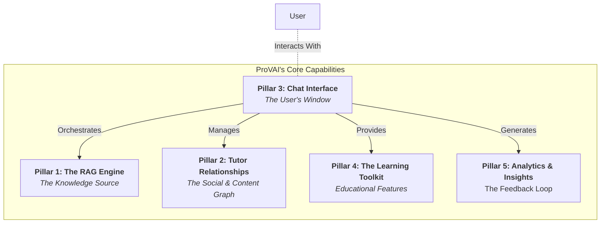

# The Five Pillars of ProVAI

This document provides a high-level overview of the five core **capabilities** or **conceptual pillars** that make up the ProVAI application. It is a product-focused guide that explains the system's architecture from its foundational technology up to the user-facing features.

---

## Conceptual Architecture Diagram

This diagram provides a visual representation of the core capabilities of ProVAI, highlighting the main components and interactions between them.

---

### **Pillar 1: The RAG Engine (The Knowledge Engine)**

**Purpose:** To serve as the core, decoupled "brain" of the application, responsible for ingesting documents and generating intelligent, context-aware answers. This is the foundational technology that makes ProVAI possible.

- **Crawl (M2):** A simple but robust LCEL chain for a "Retrieve -> Generate" workflow. Optimized for local, CPU-only hardware using `Qwen1.5-1.8B` and `fastembed`.
- **Walk (M4):** Retrieval quality will be enhanced with `Parent Document Retrieval` and `Query Structuring` for metadata filtering.
- **Run (M4):** The engine will be refactored into a `LangGraph` state machine to enable `Corrective-RAG` (web search fallback) and self-correction loops.

---

### **Pillar 2: Tutor Relationships (The Social & Content Graph)**

**Purpose:** To model the real-world relationships between teachers, students, and their shared educational content. This pillar defines the rules of ownership and access, providing the core domain structure for the application.

- **Crawl (M2):** A definitive, simple data model is established: A `User` has a global `role` ('teacher' or 'student'). A `Tutor` represents a course and has a `teacher_id` (the owner). A `tutor_students` table creates a many-to-many link for enrollments. A secure, email-based invitation system allows teachers to enroll students.
- **Walk (M4):** The API will be expanded to allow teachers to manage their student rosters (e.g., remove a student).

---

### **Pillar 3: The Chat Interface (The Presentation Layer)**

**Purpose:** To provide a seamless, intuitive, and real-time interface for all user interactions. This pillar encompasses both the visual frontend and the backend API that powers it, acting as the user's window into the system.

- **Crawl (M3):** A clean, two-panel UI built **exclusively with Streamlit**. A secure FastAPI backend provides all necessary endpoints for authentication, chat management, and document uploads.
- **Walk (M4):** The UI will be enhanced with full multi-session management, allowing users to create, switch, and delete multiple private chats.
- **Run (M4):** Advanced power-user features like multi-message selection and data portability will be implemented.

---

### **Pillar 4: The Learning Toolkit (The Educational Features)**

**Purpose:** To provide a suite of proactive, AI-powered tools that go beyond simple Q&A to actively guide and support the student's learning journey.

- **Walk (M4):** Implement a standalone `Quiz Generation` service and a `Roadmap Generation` service.
- **Run (M4):** Orchestrate these standalone tools into a complete, **Automated Learning Workflow** using LangGraph.

---

### **Pillar 5: Analytics & Insights (The Feedback Loop)**

**Purpose:** To transform raw interaction data into actionable insights for teachers, students, and developers, with a strict focus on privacy and learning improvement.

- **Crawl (M2):** Developer-focused observability is established with structured logging, LangSmith tracing, and performance benchmarking scripts.
- **Walk (M4):** A **Teacher's Insight Panel** will be implemented, showing anonymized, aggregated data on which topics the class is struggling with.
- **Run (M4):** **Intervention Tracking** will be added to measure the effectiveness of a teacher's actions, creating a full feedback loop. A **Student's Private Progress View** will be created for self-reflection.
