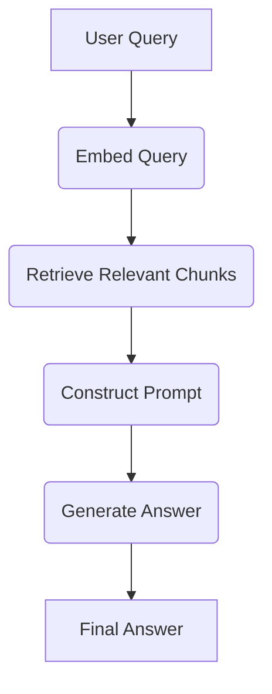
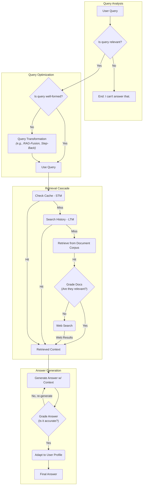

# ProVAI RAG Workflow

This document provides a visual representation of the data and logic flow within the ProVAI Retrieval-Augmented Generation (RAG) system. It outlines both the simple, linear flow for our MVP and the advanced, agentic workflow that represents our long-term target architecture.

---

## 1. MVP RAG Flow ("Crawl" Phase)

The MVP is built on a simple, linear RAG chain. Its purpose is to execute the core task of retrieving relevant context and generating a grounded answer in a straightforward and reliable manner.

### **Diagram**

### **Step-by-Step Process:**

1.  **Embed Query:** The user's raw query string is sent to the `bge-small` embedding model to be converted into a numerical vector.
2.  **Retrieve Chunks:** The query vector is used to perform a similarity search in `ChromaDB`. The top `k` most similar document chunks are returned.
3.  **Construct Prompt:** The retrieved chunks (context) and the original user query are inserted into a predefined prompt template that instructs the LLM to answer only based on the context.
4.  **Generate Answer:** The final, context-rich prompt is sent to the `Qwen1.5-1.8B` LLM, which generates the final answer.

---

## 2. ProVAI Agentic Flow ("Run" Phase Target)

This workflow represents the full vision for ProVAI's reasoning process. It is a multi-layered, decision-driven agent orchestrated by **LangGraph**. This architecture is designed to be robust, context-aware, and self-correcting, enabling a truly intelligent tutoring experience.

### **Diagram**

### **Decision-Making Process:**

1.  **Initial Query Analysis:** The agent first performs a quick check to see if the query is on-topic for the current chat. If not, it exits gracefully.
2.  **Query Optimization:** It then assesses the query's structure. If the query is vague or poorly phrased, it enters a **Query Transformation** sub-routine (e.g., RAG-Fusion) to generate better search terms.
3.  **Information Retrieval Cascade:** The agent attempts to find context from the "cheapest" and "fastest" sources first.
    - It first checks an in-memory cache for recent, identical queries.
    - If not found, it searches the user's long-term history and inferred profile for relevant context.
    - If still not found, it performs the core RAG retrieval from the document vector store.
    - **(Corrective-RAG):** It then grades the relevance of the retrieved documents. If they are poor, it triggers a final fallback to a **Web Search** tool to find better external context.
4.  **Answer Generation & Refinement:**
    - **(Self-Correction):** Once sufficient context is gathered, the agent generates an answer. It then immediately grades its own answer for factual accuracy against the source context. If a hallucination is detected, it **loops back** to re-generate the answer.
    - **(Personalization):** If the answer is factually sound, it performs a final adaptation step, tailoring the language and tone to align with the user's inferred profile before sending the final response.
